# Provado Architecture (Alpha)

This document describes the **working** Alpha architecture of Provado as it stands in
v0.2.0. For the longer-term product direction and the layers still deferred, see
[`ARCHITECTURE_DIRECTION_SOURCE.md`](ARCHITECTURE_DIRECTION_SOURCE.md).

> **Status:** Alpha. The full loop — ingestion → normalization → correlation → diagnosis →
> incident report — runs end to end inside a Laravel application, driven by **fixtures**. Real
> provider clients (New Relic NerdGraph, Adobe Commerce REST) are deferred behind the existing
> seams until a live environment is available (see the roadmap's deferred section).

## Overview

Provado ingests operational signals from ecommerce-adjacent sources, normalizes them into a
single canonical model, correlates related signals, runs deterministic diagnostic patterns
over the correlated groups, and produces a single incident report. Everything is wired into
Laravel's container and runnable from one artisan command.

```mermaid
flowchart LR
    config["config('provado')"] --> registry["SourceAdapterRegistry<br/>(enabled sources)"]
    registry -->|fetch| signals["canonical Signals"]
    signals --> store["SignalStore (per run)"]
    store --> correlation["CorrelationEngine"]
    correlation --> groups["CorrelationGroups"]
    groups --> patterns["DiagnosticPatternRegistry"]
    patterns --> findings["DiagnosticFindings"]
    findings --> builder["IncidentReportBuilder"]
    config --> builder
    builder --> report["IncidentReport"]
    report --> renderer["IncidentReportRenderer / report"]
```

The orchestration of that flow lives in `DiagnosticPipeline::run()`.

## Layers

- **Config** (`src/Config`) — `ProvadoConfig` is an immutable view of `config('provado')`,
  built via `ProvadoConfig::fromArray()`. It holds per-source `SourceConfig` + `SourceCredentials`
  and validates that enabled sources have their required options/credentials. Credentials never
  appear in serialized output (redacted).
- **Core / canonical model** (`src/Core`) — `Signal` and its value objects (`SignalId`,
  `SignalSource`, `SignalType`, `SignalSeverity`, `EntityReference`, `RawPayloadReference`,
  `TimeWindow`). This is the vocabulary everything downstream reasons over; **no vendor response
  shapes leak above the source adapter seam**.
- **Sources** (`src/Sources`) — `SourceAdapter` implementations turn a source into canonical
  signals. Today each adapter (`NewRelicAdapter`, `AdobeCommerceAdapter`) is backed by a fixture
  client plus a payload mapper (`NewRelicPayloadMapper`, `AdobeCommercePayloadMapper`). The
  `SourceAdapterRegistry` resolves which adapters run for a given config.
- **Storage** (`src/Storage`) — the `SignalStore` seam with two implementations:
  `InMemorySignalStore` (default) and `DatabaseSignalStore`. A `SignalStoreFactory` produces a
  store per run; `SignalQuery` describes filters and `SignalQuery::matches()` is the single
  predicate both stores use, so they match signals identically.
- **Correlation** (`src/Correlation`) — `CorrelationEngine` groups signals that share an entity
  into `CorrelationGroup`s (transitive, entity-based). Groups expose involved sources/types,
  shared entities, time bounds, and highest severity.
- **Patterns** (`src/Patterns`) — `DiagnosticPattern` implementations inspect a group and, if
  they `supports()` it, emit `DiagnosticFinding`s via `evaluate()`. The
  `DiagnosticPatternRegistry` holds the registered set. Current patterns:
  `CheckoutDegradationPattern` and `OrderOperationsBacklogPattern`.
- **Incidents** (`src/Incidents`) — `IncidentReportBuilder` aggregates findings into a single
  `IncidentReport` (title, summary, severity, evidence, recommended next checks); returns `null`
  when there are no findings. `IncidentReportRenderer` renders a human-readable text report.
- **Pipeline** (`src/Pipeline`) — `DiagnosticPipeline` orchestrates the whole loop and records
  a `PipelineResult` (the report, `PipelineDiagnostics`, and any errors). Supporting seams:
  `PipelineObserver`, `RetryPolicy`.
- **Console** (`src/Console`) — `DiagnoseCommand` (`provado:diagnose`) is the runnable entry
  point; `ConsolePipelineObserver` streams stage progress to the terminal.
- **Laravel integration** — `ProvadoServiceProvider` binds the whole graph into the container,
  publishes config, loads routes and migrations, and registers the command.

## Seams (extension points)

These interfaces are where Provado is meant to grow without disturbing the rest of the system:

| Seam | Role | Default(s) |
|---|---|---|
| `SourceAdapter` | Turn a source into canonical signals | `NewRelicAdapter`, `AdobeCommerceAdapter` (fixture-backed) |
| `SignalStore` / `SignalStoreFactory` | Persist & query signals per run | `InMemorySignalStore` (default), `DatabaseSignalStore` |
| `DiagnosticPattern` | Diagnose a correlated group | `CheckoutDegradationPattern`, `OrderOperationsBacklogPattern` |
| `PipelineObserver` | Observe stage boundaries (secret-safe) | `NullPipelineObserver`; `PsrLoggerObserver`; `ConsolePipelineObserver` |
| `RetryPolicy` | Drive source-fetch retries | `NoRetryPolicy` (default), `FixedRetryPolicy` |

Real provider clients land by swapping the fixture client behind a `SourceAdapter` — nothing
downstream changes because everything reasons over the canonical `Signal` model.

## Data flow (one run)

1. `DiagnosticPipeline::run(ProvadoConfig, TimeWindow)` starts; the observer is notified.
2. A fresh `SignalStore` is created for the run (`SignalStoreFactory::create()`).
3. For each **enabled** source (`SourceAdapterRegistry::enabledAdaptersFor()`), the adapter
   fetches and maps payloads into canonical signals within the window. Retryable failures are
   retried per the `RetryPolicy`.
4. Signals are saved to the store; the `CorrelationEngine` groups them by shared entity.
5. Each registered `DiagnosticPattern` that `supports()` a group is evaluated; findings are
   collected.
6. `IncidentReportBuilder` aggregates findings into a single `IncidentReport` (or `null`).
7. A `PipelineResult` is returned with the report, `PipelineDiagnostics` (counts + per-source
   summaries + stage timings), and any collected errors.

## Run isolation & persistence

Each run works in its **own** store, so a run is self-contained and never sees another run's
signals. The `InMemorySignalStore` achieves this by being ephemeral. The `DatabaseSignalStore`
achieves the same by being **run-scoped**: each `create()` mints a fresh run id, rows are
written to a shared table, and every read is scoped to that run id. The result: pipeline
behavior is identical to the in-memory store, while signals persist across processes.

## Fault isolation

A failure in one stage never aborts the whole run. Source-fetch failures are captured as
`SourceFetchError`s (with a `retryable` classification) and a failing source cannot stop the
others. Correlation, pattern-evaluation, and report-building failures are captured as
`PipelineError`s and recorded on the `PipelineResult`. The `provado:diagnose` command surfaces
both, along with per-stage timings, so a degraded run is visible without blowing up.

## What's deliberately not here yet

Per the v0.2.0 roadmap, the following are deferred behind the seams above until a real
environment or design partner pulls them forward: live New Relic (NerdGraph) and Adobe Commerce
(REST) clients, the shared HTTP transport they need, Adobe Commerce Cloud tier detection, a
broad pattern library, revenue/economic-impact logic, and Tier 1+ sources.
