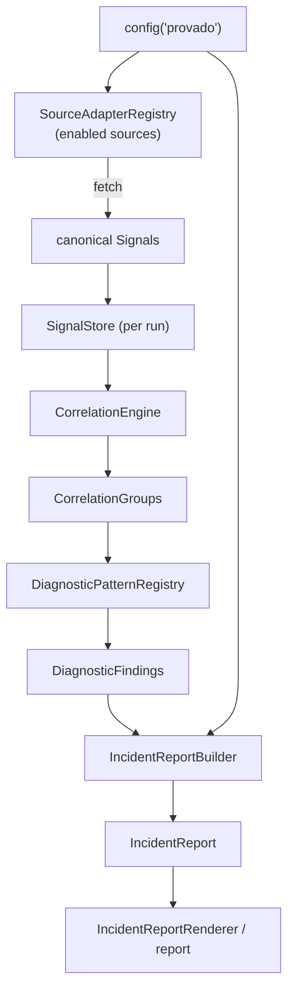

# Provado Architecture (Alpha)

This document describes the **working** Alpha architecture of Provado as it stands in
v0.3.0. For the longer-term product direction and the layers still deferred, see
[`ARCHITECTURE_DIRECTION_SOURCE.md`](ARCHITECTURE_DIRECTION_SOURCE.md).

> **Status:** Alpha. The full loop — ingestion → normalization → correlation → diagnosis →
> incident report — runs end to end inside a Laravel application, driven by **fixtures**. The
> provider-agnostic HTTP seam and credential-driven client selection real clients will use are
> now in place, but the real provider clients themselves (New Relic NerdGraph, Adobe Commerce
> REST) remain deferred behind the existing seams until a live environment is available (see the
> roadmap's deferred section).

## Overview

Provado ingests operational signals from ecommerce-adjacent sources, normalizes them into a
single canonical model, correlates related signals, runs deterministic diagnostic patterns
over the correlated groups, and produces a single incident report. Everything is wired into
Laravel's container and runnable from one artisan command.



The orchestration of that flow lives in `DiagnosticPipeline::run()`.

## Layers

- **Config** (`src/Config`) — `ProvadoConfig` is an immutable view of `config('provado')`,
  built via `ProvadoConfig::fromArray()`. It holds per-source `SourceConfig` + `SourceCredentials`
  and validates that enabled sources have their required options/credentials. Credentials never
  appear in serialized output (redacted).
- **Core / canonical model** (`src/Core`) — `Signal` and its value objects (`SignalId`,
  `SignalSource`, `SignalType`, `SignalSeverity`, `EntityReference`, `RawPayloadReference`,
  `TimeWindow`). This is the vocabulary everything downstream reasons over; **no vendor response
  shapes leak above the source adapter seam**.
- **Sources** (`src/Sources`) — `SourceAdapter` implementations turn a source into canonical
  signals. Each adapter (`NewRelicAdapter`, `AdobeCommerceAdapter`) selects its client from
  **credential presence**: when the source's required credentials are configured and a
  credentialed client (`NewRelicClient` / `AdobeCommerceClient`) is wired, the adapter delegates
  to it; otherwise it falls back to the fixture client plus a payload mapper (`NewRelicPayloadMapper`,
  `AdobeCommercePayloadMapper`). Until a real client ships, the fixture path is always taken, so
  no real calls happen. The `SourceAdapterRegistry` resolves which adapters run for a given config.
- **HTTP source-client seam** (`src/Http`) — the provider-agnostic plumbing real clients sit on.
  `HttpClient` (default `LaravelHttpClient` over Laravel's HTTP client; `FakeHttpClient` for tests)
  performs no outbound I/O until `send()` is invoked. `HttpRequest`/`HttpResponse` are canonical
  value objects; `HttpTransportException` marks connection/timeout failures. `HttpSourceErrorFactory`
  maps transport failures and HTTP error statuses to `SourceFetchError` with the right `retryable`
  classification (timeouts/5xx/429 retryable, honoring `Retry-After`; 401/403/4xx not), so the
  existing `RetryPolicy` drives retries. No vendor response shapes cross this boundary.
- **Storage** (`src/Storage`) — the `SignalStore` seam with two implementations:
  `InMemorySignalStore` (default) and `DatabaseSignalStore`. A `SignalStoreFactory` produces a
  store per run; `SignalQuery` describes filters and `SignalQuery::matches()` is the single
  predicate both stores use, so they match signals identically.
- **Correlation** (`src/Correlation`) — `CorrelationEngine` groups signals that share an entity
  into `CorrelationGroup`s (transitive, entity-based). `CorrelationCriteria::withTimeProximity()`
  optionally also joins signals whose timestamps fall within a threshold (off by default). Groups
  expose involved sources/types, shared entities, time bounds, and highest severity.
- **Patterns** (`src/Patterns`) — `DiagnosticPattern` implementations inspect a group and, if
  they `supports()` it, emit `DiagnosticFinding`s via `evaluate()`. The
  `DiagnosticPatternRegistry` holds the registered set; the `DiagnosticEvidence` trait provides
  the shared evidence/severity scaffolding. Current patterns: `CheckoutDegradationPattern`,
  `OrderOperationsBacklogPattern`, `PaymentConfigRegressionPattern` (3DS/payment-config
  regression), and `CatalogFeedSyncFailurePattern`.
- **Incidents** (`src/Incidents`) — `IncidentReportBuilder` aggregates findings into a single
  `IncidentReport` (title, summary, severity, evidence, recommended next checks); returns `null`
  when there are no findings. Aggregated evidence is de-duplicated by finding id and ordered by
  severity (most severe first). `IncidentReportRenderer` renders a human-readable text report.
- **Pipeline** (`src/Pipeline`) — `DiagnosticPipeline` orchestrates the whole loop and records
  a `PipelineResult` (the report, `PipelineDiagnostics`, and any errors). Supporting seams:
  `PipelineObserver`, `RetryPolicy`.
- **Console** (`src/Console`) — `DiagnoseCommand` (`provado:diagnose`) is the runnable entry
  point; `ConsolePipelineObserver` streams stage progress to the terminal.
- **Laravel integration** — `ProvadoServiceProvider` binds the whole graph into the container,
  publishes config, loads routes and migrations, and registers the command.

## Seams (extension points)

These interfaces are where Provado is meant to grow without disturbing the rest of the system:

| Seam | Role | Default(s) |
|---|---|---|
| `SourceAdapter` | Turn a source into canonical signals | `NewRelicAdapter`, `AdobeCommerceAdapter` (fixture-backed) |
| `NewRelicClient` / `AdobeCommerceClient` | Credentialed per-source client the adapter selects when credentials are present | none yet (deferred real clients); fixture fallback otherwise |
| `HttpClient` | Provider-agnostic HTTP transport for real clients | `LaravelHttpClient` (default), `FakeHttpClient` (tests) |
| `SignalStore` / `SignalStoreFactory` | Persist & query signals per run | `InMemorySignalStore` (default), `DatabaseSignalStore` |
| `DiagnosticPattern` | Diagnose a correlated group | `CheckoutDegradationPattern`, `OrderOperationsBacklogPattern`, `PaymentConfigRegressionPattern`, `CatalogFeedSyncFailurePattern` |
| `PipelineObserver` | Observe stage boundaries (secret-safe) | `NullPipelineObserver`; `PsrLoggerObserver`; `ConsolePipelineObserver` |
| `RetryPolicy` | Drive source-fetch retries | `NoRetryPolicy` (default), `FixedRetryPolicy` |

Real provider clients land by implementing the per-source client interface (`NewRelicClient` /
`AdobeCommerceClient`) on top of the `HttpClient` seam; the adapter selects it once credentials
are configured, falling back to fixtures otherwise. Nothing downstream changes because everything
reasons over the canonical `Signal` model.

## Contract tests

Contract tests assert that a client maps a provider's HTTP response into the right canonical
signals, using **recorded responses** — no live capture. Recordings live under a fixed convention:

```
tests/Contracts/recordings/{provider}/{name}.json
```

Each recording defines a `status`, optional `headers`, and either an inline `body` (string or JSON
object) or a `body_fixture` pointer that reuses an existing `tests/Fixtures/{path}.json` sample
payload. `tests/Contracts/RecordedResponseLoader` loads a recording into a canonical `HttpResponse`,
which a test replays through `FakeHttpClient` and feeds to the client under test. When the deferred
real clients land, their contract tests drop into this convention unchanged.

## Data flow (one run)

1. `DiagnosticPipeline::run(ProvadoConfig, TimeWindow)` starts; the observer is notified.
2. A fresh `SignalStore` is created for the run (`SignalStoreFactory::create()`).
3. For each **enabled** source (`SourceAdapterRegistry::enabledAdaptersFor()`), the adapter
   selects its client by credential presence (credentialed client when configured, fixture client
   otherwise) and maps payloads into canonical signals within the window. Retryable failures are
   retried per the `RetryPolicy`.
4. Signals are saved to the store; the `CorrelationEngine` groups them by shared entity.
5. Each registered `DiagnosticPattern` that `supports()` a group is evaluated; findings are
   collected.
6. `IncidentReportBuilder` aggregates findings into a single `IncidentReport` (or `null`).
7. A `PipelineResult` is returned with the report, `PipelineDiagnostics` (counts + per-source
   summaries + stage timings), and any collected errors.

## Run isolation & persistence

Each run works in its **own** store, so a run is self-contained and never sees another run's
signals. The `InMemorySignalStore` achieves this by being ephemeral. The `DatabaseSignalStore`
achieves the same by being **run-scoped**: each `create()` mints a fresh run id, rows are
written to a shared table, and every read is scoped to that run id. The result: pipeline
behavior is identical to the in-memory store, while signals persist across processes.

## Fault isolation

A failure in one stage never aborts the whole run. Source-fetch failures are captured as
`SourceFetchError`s (with a `retryable` classification) and a failing source cannot stop the
others. Correlation, pattern-evaluation, and report-building failures are captured as
`PipelineError`s and recorded on the `PipelineResult`. The `provado:diagnose` command surfaces
both, along with per-stage timings, so a degraded run is visible without blowing up.

## What's deliberately not here yet

The following remain deferred behind the seams above until a real environment or design partner
pulls them forward: live New Relic (NerdGraph) and Adobe Commerce (REST) clients, Adobe Commerce
Cloud tier detection, a broad pattern library, revenue/economic-impact logic, and Tier 1+ sources.
The shared HTTP transport those clients need now exists (the `HttpClient` seam above); only the
provider-specific clients themselves are deferred.
