# Provado — Coverage Map

**What this is:** an honest, living map of *where diagnosis actually stands* — not what is
planned, not what a fixture demonstrates, but what Provado concludes on **live** data today.
Two views: **by signal** (what raw material exists) and **by failure mode** (what can actually
be concluded). The gap between them is where the value is.

> **Measured against:** release **v0.7.0** (lead-pattern completion).
> **Last updated:** 2026-07-01.
> **Rule:** update this alongside the roadmap-item checkbox in the same commit. Do **not** mark a
> row green because a signal ships or a fixture passes — green means *diagnosed on live data*.

## Legend

| Mark | Meaning |
|---|---|
| 🟢 | Diagnosed on **live** data, working |
| 🟡 | **Partial** — shipped + diagnosed, but with real gaps (missing shapes/sub-variants, or only via the cron-collapse, or organic behavior unverified) |
| ⚪ | **Fixture / demo only** — a pattern exists but no live signal feeds it |
| 🔴 | **Not covered** — no signal and/or no pattern |
| 🚧 | **Gated** — needs infra the lab doesn't have |

## Overview

```mermaid
flowchart TB
    classDef green  fill:#d4edda,stroke:#28a745,color:#000
    classDef yellow fill:#fff3cd,stroke:#e67e22,color:#000
    classDef white  fill:#eef0f2,stroke:#8a8f98,color:#000
    classDef red    fill:#f8d7da,stroke:#c0392b,color:#000

    CRON["Núcleo operativo (live)<br/>cron_health → lead pattern 🟢<br/><small>index · queue · cache · email edges 🟡</small>"]:::green

    subgraph modes["Los 12 modos de fallo"]
        direction TB
        M1["#1 Silent consumer/queue death"]:::yellow
        M4["#4 Indexer stagnation → stale price/search"]:::yellow
        M5["#5 Deploy/config regression<br/><small>señal live, sin diagnóstico</small>"]:::red
        M8["#8 Cross-system sync stoppage (ERP/feed)"]:::white
        M2["#2 Inventory drift"]:::red
        M3["#3 Promotion/price-rule"]:::red
        M6["#6 Silent order loss"]:::red
        M7["#7 Order created, payment never captured"]:::red
        M10["#10 Per-region config break"]:::red
        M12["#12 Cacheability broken by deploy"]:::red
        M9["#9 Bot blocked at edge/WAF"]:::red
        M11["#11 Measurement/consent/tag"]:::red
    end

    CRON --> M1
    CRON --> M4
    CRON --> M5

    LEG["🟢 live · 🟡 parcial · ⚪ fixture-only · 🔴 no · 🚧 gated<br/>0/12 verde · 2 amarillo (#1 #4) · 1 fixture (#8) · 9 rojo (2 gated)"]
```

## Big picture: 6 huecos estructurales (transversales)

Estos no son de un modo en particular — atraviesan todo y son la razón de la mayoría de los 🟡:

| # | Hueco | Impacto | Se cierra en |
|---|---|---|---|
| E1 | **CERRADO (v0.8.0 P2, 2026-07-01).** El colapso del lead pattern era orgánico pero incidental: dependía de que el **agente PHP de New Relic auto-inyecta `host`** (solo Shipper B). Ahora **ambos shippers estampan `source_instance` en cada evento** y `signal_entity_fields` lo mapea → las 6 señales de una instancia comparten `source_instance` **por diseño**, independiente del agente. Verificado live: `uniques(source_instance)` = `provado` en los 6 tipos de señal vía NerdGraph. | **Resuelto:** el colapso es ahora **intencional y portable** entre los tres shippers; el Shipper C (Event API, sin auto-`host`) también colapsa (cubierto por test de correlación con solo `source_instance`). | ✅ v0.8.0 P2 |
| E2 | **Sin diagnóstico operativo standalone.** Todo cuelga de `CronHealthPattern`; un consumer/indexer muerto con cron sano no produce nada. | Mitad de las sub-variantes de #1/#4 son invisibles. | v0.10.0 P1 |
| E3 | **Síntoma ↔ causa nunca se correlacionan.** Familias distintas no comparten entidad. | Lo que vende la tesis no ocurre. | v0.9.0 P2 |
| E4 | **Señales live de síntoma no consumidas.** `transaction_health` (NerdGraph) y `order_activity` (REST) se producen live pero ningún patrón las lee; los 4 patrones-síntoma corren solo sobre fixtures. | La capa-síntoma es demo, no diagnóstico live. | v0.9.0 P2 |
| E5 | **Correlación solo binaria, sin peso temporal.** | Atribución "todo lo del grupo cuenta", sin confianza. | v0.9.0 P1 |
| E6 | **Grupos efímeros; criterios y grafo code-only.** | Sin historia, sin ajuste sin deploy. | v0.9.0 P3 |

---

## Vista A — por señal (¿qué materia prima existe?)

### Núcleo operativo — live-shipped vía `ProvadoSignal` → NerdGraph

| Señal | Estado | ✅ Lo que ya está | ❌ Lo que falta |
|---|---|---|---|
| `cron_health` | 🟢 | Shipped live; diagnosticado como raíz (`missed>0`, `pending`/`error` vs baseline aprendido, `running` estancado); dwell onset-based. **Colapso downstream verificado orgánico en lab (P1 item 1): 1 veredicto crítico plegando edges de indexer + cache reales, unidos por `host:provado` auto-inyectado por el agente NR** | Caveat residual: el colapso depende del `host` que inyecta el agente NR (Shipper B); Shipper C/Event API no lo manda → se hace intencional en P2 (ver E1) |
| `indexer_status` | 🟡 | Shipped live (backlog, working, invalid); edge `cron→index` (`backlog>0 || invalid>0`); dwell | Shape *"working con backlog 0"* (ACSD-51431, valid-while-failed) no detectado — el shipper manda `working` pero el patrón no lo lee; standalone (E2); mitad motor de búsqueda |
| `queue_backlog` | 🟡 | Shipped live (ready/unacked/consumers + fallback DB new/in_progress/error); edge `cron→queue` (`ready>0 && consumers==0`) | Eje **progress** (ack_rate/deltas) — no se shippea; shape *"vivo pero estancado"*; DB in_progress/error no diagnosticado; standalone (E2) |
| `cache_validity` | 🟡 | Shipped live (1 evento/tipo, invalidated 0/1); edge `cron→cache` (`invalidated>0`); dwell | Standalone (E2); colapso orgánico (E1) |
| `consumer_liveness` | 🟡 | Shipped live (has_messages/running vía `isLocked`); edge `cron→email` (`has_messages>0 && running==0`); dedup por link consumer→queue | Sub-var *lock atascado* (`running=1` pero muerto) no detectable; *kill switch* (deja de shippear); standalone (E2) |
| `config_change` | 🟡 | Shipped live (churn de `core_config_data`); usado como change-stamp (`recent_config_change`) dentro del veredicto de cron | Standalone; deploy markers de NR; superficie env.php |

### Capa-síntoma / commerce-state

| Señal | Estado | ✅ Lo que ya está | ❌ Lo que falta |
|---|---|---|---|
| `transaction_health` | ⚪ | Producida **live** por NerdGraph (modo transaction_health) | **Ningún patrón la consume** (E4) |
| `order_activity` | ⚪ | Producida **live** por REST (order_count, gross_total, per-status) | **Ningún patrón la consume** (E4) |
| `checkout_failure_rate`, `transaction_slowdown`, `latency_spike`, `error_rate_spike` | ⚪ | Fixture-only → `CheckoutDegradationPattern` | Ningún cliente live las produce (E4) |
| `payment_config_change`, `three_ds_config_change` | ⚪ | Fixture-only → `PaymentConfigRegressionPattern` (ni siquiera en los fixtures por defecto) | Cliente live; fuente PSP |
| `catalog_feed_sync_failure`, `inventory_sync_drift`, `indexer_stuck`, `order_sync_backlog` | ⚪ | Fixture-only → `CatalogFeedSyncFailurePattern` / `OrderOperationsBacklogPattern` | Fuente live (ERP/feed real) |

### Señales del catálogo aún no shippeadas

| Señal | Estado | Nota | Se cierra en |
|---|---|---|---|
| `schema_drift` | 🔴 | `setup_module` schema vs data version | v0.10.0 P2 |
| `maintenance_flag` | 🔴 | `var/.maintenance.flag` stat | v0.10.0 P2 |
| search-engine cluster | 🔴 | OpenSearch/ES `_count` + cluster status | v0.10.0 P3 |
| `order_integrity` | 🔴 | quote fingerprint (#6), auth-sin-capture aging (#7) | v0.11.0 P1 |
| NR deploy markers | 🔴🚧 | `FROM Deployment` (change spine) | v0.11.0 P2 |

---

## Vista B — por modo de fallo (¿qué puedo concluir?)

| # | Modo | Estado | ✅ Lo que ya está | ❌ Lo que falta |
|---|---|---|---|---|
| **1** | Silent consumer / queue death | 🟡 ~25% | `queue_backlog` + `consumer_liveness` live; shape *"desconectado/muerto"* vía edges `cron→queue` (`ready>0 && consumers==0`) / `cron→email` (`has_messages>0 && running==0`); dwell + dedup por queue. **Colapso vía cron verificado orgánico (P1 item 1)** | **Fallback DB-queue (`new`/`in_progress`/`error`) se shippea pero NUNCA se diagnostica: `isSymptomatic('queue')` solo mira `ready`+`consumers`, que el evento `db` no lleva**; eje progress (`ack_rate`) no se shippea → *"vivo pero estancado"* invisible; sub-var mensaje-envenenado / lock-atascado (`running=1` pero muerto) / kill-switch; standalone (E2) |
| **4** | Indexer stagnation → stale price/search | 🟡 | `indexer_status` live (backlog/invalid); edge `cron→index` (`backlog>0 || invalid>0`); dwell. **Edge cron→index verificado orgánico (P1 item 1): indexers `invalid=1` plegados en el veredicto de cron** | Shape *valid-while-failed*: **el shipper manda `working` pero el patrón lo ignora** (`isSymptomatic('index')` solo mira `backlog`/`invalid`, nunca `working`) → view atascado en "working" con 0 backlog no se detecta; standalone (E2); **mitad motor de búsqueda** (OpenSearch cluster) |
| **5** | Deploy/config regression ("what changed") | 🟡→ 🔴 para diagnóstico | `config_change` live (superficie sin-marcador `core_config_data`) | **No hay diagnóstico de este modo.** `config_change` **solo** se lee dentro de `CronHealthPattern` como stamp pasivo (`recent_config_change` / `latest_config_change_age_seconds`) — **ningún patrón produce un finding a partir de él**; sin un veredicto de cron no aporta nada. Falta: **deploy markers de NR** (`FROM Deployment`), atribución standalone (correlacionar un cambio con un síntoma sin depender del cron), superficie env.php |
| **8** | Cross-system sync stoppage (ERP/feed) | ⚪ | `CatalogFeedSyncFailurePattern` existe; `SIM-ERP-001` reproducido | **Fixture-only confirmado en código:** el patrón exige tipos `catalog_feed_sync_failure` + (`indexer_stuck`\|`inventory_sync_drift`) desde `adobe_commerce`, pero el adaptador REST live produce **solo `order_activity`** → nunca dispara fuera de fixtures. Falta: fuente ERP real (Odoo); `magento_operation`/`magento_bulk`; wiring live |
| **2** | Inventory drift / oversell | 🔴 | Nada (fixture `inventory_sync_drift` solo alimenta el patrón de catálogo como impacto, no un diagnóstico de drift) | `inventory_reservation` net≠0, salable qty, consumer `updateSalabilityStatus` |
| **3** | Promotion / price-rule deja de aplicar | 🔴 | Nada | `catalogrule_product_price` materialización, usage caps, effect (`salesrule_coupon_aggregated`) |
| **6** | Silent order loss (quote huérfana) | 🔴 | Nada (`order_activity` live existe pero sin patrón; `SIM-PAY-001` draft) | quote fingerprint (`reserved_order_id`, `is_active=1`, sin `sales_order`); señal `order_integrity` |
| **7** | Order creado, pago nunca capturado | 🔴 | Nada (`SIM-PAY-002` draft; PaymentConfigRegression es 3DS-config, fixture) | `sales_payment_transaction` auth-sin-capture aging; reconciliación PSP |
| **10** | Per-region tax/payment config break | 🔴 | Nada | `core_config_data` con scope, `tax_calculation_*`, éxito de checkout por `store_id` |
| **12** | Cacheability rota por deploy | 🔴 | Nada (`cache_validity` es invalidación, **no** cacheability) | FPC hit-ratio, blast-radius de `cacheable="false"` |
| **9** | Bot bueno bloqueado en edge/WAF | 🔴🚧 | Nada | Fuente Fastly/CDN/WAF (sin infra en el lab) |
| **11** | Measurement / consent / tag breakage | 🔴🚧 | Nada | Stack GA4/consent (sin infra en el lab) |

**Conteo (re-auditado 2026-07-01, v0.8.0 P1 item 2):** 0/12 diagnosticados live de verdad · **2 parciales (#1, #4)** — y su slice cron-atribuido quedó **verificado orgánico** en P1 item 1 · **#5 baja a señal-live-sin-diagnóstico** (`config_change` se shippea pero ningún patrón lo diagnostica; solo es stamp) · 1 fixture-only (#8) · resto 🔴 (2 gated).

> **Re-auditoría #1/#4/#5/#8 (2026-07-01, v0.8.0 P1 item 2) — contra el código, no contra fixtures:**
> - **#1** — el slice cron-atribuido (queue desconectada / consumer muerto) ahora está **verificado en vivo** (P1 item 1). Gap nuevo hallado: el evento fallback `queue:db` (`new`/`in_progress`/`error`) **se shippea pero es indiagnosticable** — la condición de síntoma solo mira `ready`+`consumers`.
> - **#4** — edge `cron→index` **verificado en vivo**. El shipper manda el flag `working` pero el patrón **no lo usa**: la variante *valid-while-failed* (working, 0 backlog) sigue invisible pese a que el dato llega.
> - **#5** — corrección de sobre-optimismo: **no hay diagnóstico**. `config_change` solo decora el veredicto de cron; no existe patrón que lo lea como modo. Era el 🟡 más generoso del mapa.
> - **#8** — fixture-only **confirmado en código**: los tipos que el patrón exige no los produce ninguna fuente live (REST solo emite `order_activity`).

---

## Cómo leer este mapa (la trampa que evita)

Un modo puede estar verde en "señal" y rojo en "diagnóstico". `#1` fue el ejemplo: la señal existe,
pero solo se diagnostica el slice cron-atribuido y un solo shape. Por eso cada fila separa
**lo que ya está** de **lo que falta**, y "🟢" está reservado para *diagnóstico live que funciona* —
no para "la señal llega" ni para "el fixture pasa".

## Dónde se cierra cada hueco

- **E1, #1/#4/#5 (correlación real + fidelidad):** [`v0.8.0`](roadmaps/v0.8.0.md)
- **E3, E4, E5, E6 (correlación inteligente + cross-family):** [`v0.9.0`](roadmaps/v0.9.0.md)
- **E2, #1/#4 restante, #8 wiring, search, easy wins:** [`v0.10.0`](roadmaps/v0.10.0.md)
- **#6, #7, #5 deploy markers:** [`v0.11.0`](roadmaps/v0.11.0.md)
- **#2, #3, #10, #12:** breadth sin agendar. **#9, #11:** gated (sin infra).
